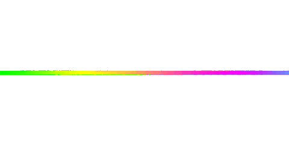

🔗 Click the banner above to visit my [LinkedIn](https://www.linkedin.com/in/ratul-banik1204/)

  

  
  ### 🚀 **Ratul Banik** 
  #### *B.Tech Computer Science Engineering | AI & Web Developer*
  
  
  
  
  
---
  
  ### 🌟 **Quick Stats**
  
  
  
  
  

<h1 align="center">Hi there, I'm Ratul Banik 👋🏼</h1>
<h3 align="center">B.Tech CSE | PY & Web Developer from India 🇮🇳</h3>

  I'm a Computer Science Engineering student (2023-2027) with a deep passion for transforming complex problems into elegant, full-stack solutions. I am driven by the process of building and am currently dedicating my time to mastering Data Structures & Algorithms while developing robust applications with the MERN stack.

  
  

  

### A Little More About Me...

* 🔭 I'm currently building projects with the **MERN (MongoDB, Express, React, Node.js) Stack**.
* 🌱 I'm sharpening my problem-solving skills daily on **LeetCode** and **HackerRank**.
* 👯 I'm looking to collaborate on innovative open-source web projects.
* 📫 You can reach me at **ratulbanik1204@gmail.com**.

  

  
🎯 <b>Core Competencies & Focus Areas</b>

### 💻 **Programming Languages**

  
  
  
  
  

<blockquote>
  Strong foundation in core programming languages with focus on problem-solving and algorithmic thinking.
</blockquote>

### 🌐 **Web Fundamentals**

  
  
  

<blockquote>
  Building semantic, accessible, and responsive web interfaces with modern standards.
</blockquote>

### ⚡ **Frameworks & Libraries**

  
  
  
  
  

<blockquote>
  Actively learning and building full-stack applications with the MERN stack and modern development tools.
</blockquote>

  

  
🌟<b>Skill Matrix</b>

  
### 🎯 **Experience Levels**

<table width="100%">
  <tr>
    <td width="33%" align="center">
      <h4>🚀 **Strong Foundation**</h4>
      
        
      
    </td>
    <td width="33%" align="center">
      <h4>⚡ **Good Understanding**</h4>
      
        
      
    </td>
    <td width="33%" align="center">
      <h4>🌱 **Currently Learning**</h4>
      
        
      
    </td>
  </tr>
</table>

### 📚 **Learning Roadmap**

  <strong>Current Focus:</strong> JavaScript → React → MERN Stack → Advanced AI
   
  <strong>Goal:</strong> Full Stack Internship & MERN Mastery

### 🎯 **Current Learning Focus**

<table width="100%">
  <tr>
    <td width="50%" align="center">
      <h4>🚀 **MERN Stack Development**</h4>
      <strong>Status: Actively Learning</strong>
        
      <em>Currently working on React, Node.js, and Express fundamentals</em>
    </td>
    <td width="50%" align="center">
      <h4>💼 **Career Preparation**</h4>
      <strong>Status: Building Portfolio</strong>
        
      <em>Working on projects and improving skills for opportunities</em>
    </td>
  </tr>
  <tr>
    <td width="50%" align="center">
      <h4>🧠 **DSA & Problem Solving**</h4>
      <strong>Status: Regular Practice</strong>
        
      <em>Solving problems on LeetCode and HackerRank</em>
    </td>
    <td width="50%" align="center">
      <h4>🤖 **AI & Machine Learning**</h4>
      <strong>Status: Basic Understanding</strong>
        
      <em>Learning Python fundamentals and basic ML concepts</em>
    </td>
  </tr>
</table>

### 🏆 **Recent Achievements**

  
  
  

---

  
📊<b>Advanced Analytics & Insights</b>

  
### 🚀 **GitHub Analytics & Performance**

<table width="100%">
  <tr>
    <td width="50%" valign="top">
      
    </td>
    <td width="50%" valign="top">
      
    </td>
  </tr>
</table>

### 🔥 **Coding Streak & Consistency**

  

### 📈 **Detailed Language Statistics**

  

### 🎯 **Repository Insights**

  

### 📊 **Contribution Graph**

  

### 🏅 **Profile Summary Cards**

  

  

  

  

  

  

  
🚀<b>Featured Projects & Achievements</b>

### 🎯 **Project Showcase**

*Coming Soon! I'm currently building amazing projects that will be showcased here once they're ready for GitHub.* 🚀

**What I'm Working On:**
- **🤖 AI/ML Projects** - Learning Python and basic ML concepts
- **🌐 Web Development** - Building MERN stack applications  
- **🔧 Learning Projects** - Small applications to practice coding
- **📱 Web Apps** - Building responsive web applications

### 🏆 **Achievement Highlights**

<table width="100%">
  <tr>
    <td width="50%" align="center">
      <h4>🎓 Academic Excellence</h4>
      
        
      <strong>Computer Science Engineering</strong>
       
      <em>Currently pursuing with focus on AI & Web Development</em>
    </td>
    <td width="50%" align="center">
      <h4>🚀 Career Goals</h4>
      
        
      <strong>MERN Stack Mastery</strong>
       
      <em>Building portfolio and learning actively</em>
    </td>
  </tr>
</table>

### 📈 **Current Learning Status**

  <strong>Technologies I'm Currently Working With:</strong>
   
  
  
  
  

  

🌟<b>Collaboration Hub & Open Source</b>

### 🌟 **Areas of Interest**

  
  
  

### 🚀 **Collaboration Opportunities**
- **🤖 AI/ML Projects** - Basic Python projects, learning ML concepts
- **🌐 Web Development** - React, Node.js, building web applications
- **📱 Learning Together** - Exploring new technologies and frameworks
- **🔧 Project Building** - Working on small applications and tools
- **📚 Knowledge Sharing** - Learning from others and sharing what I learn

### 💡 **What I'm Learning & Building**
- **Problem-Solving Skills** - Building DSA foundation through LeetCode/HackerRank
- **Full-Stack Development** - Learning MERN stack fundamentals
- **AI/ML Basics** - Exploring Python and basic machine learning concepts
- **Project Building** - Working on small projects to apply knowledge
- **Collaboration** - Open to learning from and working with others

### 📫 **Get in Touch for Collaboration**

  
  
  

  

  
📱<b>Mobile-First Design & Interactive Elements</b>

### 🎨 **Design Features**

  
  <table width="100%">
    <tr>
      <td width="33%" align="center">
        <h4>📱 **Mobile Friendly**</h4>
        
          
        <strong>Optimized for all devices</strong>
      </td>
      <td width="33%" align="center">
        <h4>⚡ **Clean Layout**</h4>
        
          
        <strong>Well-organized structure</strong>
      </td>
      <td width="33%" align="center">
        <h4>🎯 **Professional**</h4>
        
          
        <strong>Industry standard format</strong>
      </td>
    </tr>
  </table>
  

### 🌟 **Interactive Features**

🎭 **Click to see Interactive Elements**

- **🔄 Auto-updating stats** from GitHub APIs
- **📊 Dynamic charts** that update in real-time
- **🎨 Hover effects** on badges and buttons
- **📱 Responsive tables** that adapt to screen size
- **🔗 Smart links** with preview tooltips
- **📈 Live progress tracking** for your goals

### 🏆 **README Features**

<table width="100%">
  <tr>
    <td width="50%" align="center">
      <h4>📊 **Content Quality**</h4>
      
        
      
        
      <strong>Clear and informative</strong>
    </td>
    <td width="50%" align="center">
      <h4>🚀 **User Experience**</h4>
      
        
      
        
      <strong>Easy to navigate</strong>
    </td>
  </tr>
</table>

  

  
🚀<b>Data Structures & Algorithms</b>

  
  
  

<blockquote>
  My primary focus is on strengthening my problem-solving foundation by consistently tackling challenges on <strong>LeetCode</strong> and <strong>HackerRank</strong>. This sharpens my logical thinking and efficiency.
</blockquote>

### 💻 **Full-Stack Development**

  
  
  
  

<blockquote>
  I am actively learning and building projects with the <strong>MERN stack</strong> to develop web applications and gain practical experience.
</blockquote>

### 🌐 **Web Fundamentals**

  
  
  

<blockquote>
  Building a solid foundation in core web technologies to create semantic, accessible, and responsive user interfaces.
</blockquote>

  

  
🧰<b>Tech Stack & Tools</b>

I am learning and working with various technologies, which I have organized by category below.

| Category | Technologies |
| :--- | :--- |
| **Languages** |     |
| **Frontend Development** |     |
| **Backend Development** |   |
| **Databases** |  |
| **Developer Tools** |   |

  

  
👨‍💻<b>Competitive Programming</b>

<b>I actively practice problem-solving to sharpen my logical and algorithmic thinking. You can find my profiles here:</b>

  
  &nbsp;&nbsp;&nbsp;
  

  

  
## 🐍 **GitHub Snake Contribution Animation**

### 🌟 **Main Contribution Snake**

### 🎨 **Alternative Snake Styles**

<table width="100%">
  <tr>
    <td width="33%" align="center">
      <strong>🌊 Dark Theme</strong> 
             
    </td>
    <td width="33%" align="center">
      <strong>🎨 Classic Theme</strong> 
             
    </td>
    <td width="33%" align="center">
      <strong>🌊 Ocean Theme</strong> 
             
    </td>
  </tr>
</table>

---

  
  ### 🎯 **Current Focus Areas**
  
  
  
  
  

  
  

### 🌟 **Let's Build Something Amazing Together!**

  
  ### 🚀 **Ready to Collaborate?**
  
  **I'm always excited to work on innovative projects and learn from amazing developers like you!**
  
<em>Let's connect and build something incredible together! 🚀</em>

  
  

  
  

  

  
  ### 📫 **Get in Touch**
  
  
  
  
   

Feel free to reach out. I'm always open to connecting with new people!

  
  &nbsp;
  
  &nbsp;
  
  &nbsp;
  
  &nbsp;
  

  

  

  
  <h3>🌟 <strong>Thanks for visiting my profile!</strong> 🌟</h3>

  
  

    <strong>Made with ❤️ by rb</strong>
     
    <em>I use arch BTW</em>
  

