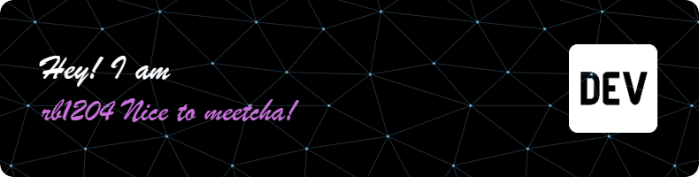

🔗 Click the banner above to visit my [LinkedIn](https://www.linkedin.com/in/ratul-banik1204/)

<h1 align="center">Hi there, I'm Ratul Banik 👋🏼</h1>
<h3 align="center">A PY & MERN STACK DEV from India 🇮🇳</h3>

  I'm a Computer Science Engineering student (2023-2027) with a deep passion for transforming complex problems into elegant, full-stack solutions. I am driven by the process of building and am currently dedicating my time to mastering Data Structures & Algorithms while developing robust applications with the MERN stack.

  
  

---

### A Little More About Me...

* 🔭 I’m currently building projects with the **MERN (MongoDB, Express, React, Node.js) Stack**.
* 🌱 I’m sharpening my problem-solving skills daily on **LeetCode** and **HackerRank**.
* 👯 I’m looking to collaborate on innovative open-source web projects.
* 📫 You can reach me at **ratulbanik1204@gmail.com**.

---
### 📊 My GitHub Stats & Trophies

This comprehensive dashboard showcases my coding journey, achievements, and technical expertise across various platforms.

 

#### 🚀 **GitHub Analytics & Performance**
<table width="100%">
  <tr>
    <td width="50%" valign="top">
      
    </td>
    <td width="50%" valign="top">
      
    </td>
  </tr>
</table>

#### 🔥 **Coding Streak & Consistency**

  

#### 🏆 **GitHub Achievements & Trophies**

  

#### 📈 **Detailed Language Statistics**

  

#### 🎯 **Repository Insights**

  

#### 📊 **Contribution Graph**

  

#### 🏅 **Profile Summary Cards**

  

  

  

  

  

---
### 🎯 Core Competencies & Focus Areas

#### 💻 Programming Languages

  
  
  
  
  

<blockquote>
  Strong foundation in core programming languages with focus on problem-solving and algorithmic thinking.
</blockquote>

#### 🌐 Web Fundamentals

  
  
  

<blockquote>
  Proficient in building semantic, accessible, and responsive web interfaces with modern standards.
</blockquote>

#### ⚡ Frameworks & Libraries

  
  
  
  
  

<blockquote>
  Actively building full-stack applications with the MERN stack and modern development tools.
</blockquote>
### 🚀 Data Structures & Algorithms

  
  
  

<blockquote>
  My primary focus is on strengthening my problem-solving foundation by consistently tackling challenges on <strong>LeetCode</strong> and <strong>HackerRank</strong>. This sharpens my logical thinking and efficiency.
</blockquote>

### 💻 Full-Stack Development

  
  
  
  

<blockquote>
  I am actively learning and building projects with the <strong>MERN stack</strong> to create modern, responsive, and scalable web applications from end to end.
</blockquote>

### 🌐 Web Fundamentals

  
  
  

<blockquote>
  With a solid and proficient understanding of core web technologies, I can build semantic, accessible, and pixel-perfect user interfaces.
</blockquote>

---

### 🧰 Tech Stack & Tools

I have experience with a diverse range of technologies, which I have organized by category below.

| Category | Technologies |
| :--- | :--- |
| **Languages** |     |
| **Frontend Development** |     |
| **Backend Development** |    |
| **Databases** |    |
| **Developer Tools** |   |

---

### 👨‍💻 Competitive Programming

I actively practice problem-solving to sharpen my logical and algorithmic thinking. You can find my profiles here:

  
  &nbsp;&nbsp;&nbsp;
  

---

### 🤝 Let's Connect

Feel free to reach out. I'm always open to connecting with new people!

  
  &nbsp;
  
  &nbsp;
  
  &nbsp;
  
  &nbsp;
  

---
## 🐍 GitHub Snake Contribution Animation

### 🌟 **Main Contribution Snake**

### 🎨 **Multiple Theme Variations**
<table width="100%">
  <tr>
    <td width="50%" align="center">
      <strong>🌊 Ocean Theme</strong> 
      
    </td>
    <td width="50%" align="center">
      <strong>💫 Neon Theme</strong> 
      
    </td>
  </tr>
  <tr>
    <td width="50%" align="center">
      <strong>🌅 Sunset Theme</strong> 
      
    </td>
    <td width="50%" align="center">
      <strong>🌲 Forest Theme</strong> 
      
    </td>
  </tr>
</table>

### 🎬 **Classic Theme**

  <strong>🎨 Classic GitHub Theme</strong> 
  

🔧 <strong>Snake Configuration Details</strong>

This snake animation is generated automatically by GitHub Actions using the enhanced workflow that creates multiple themed versions:

- **Update Frequency**: 3 times daily (midnight, noon, 6 PM UTC)
- **Themes Available**: Dark, Ocean, Neon, Sunset, Forest, Classic
- **Auto-Trigger**: Updates on every push and pull request
- **Custom Colors**: Each theme uses unique color palettes

[View Snake Workflow →](https://github.com/rbanik1204/rbanik1204/actions/workflows/snake.yml)
[View All Outputs →](https://github.com/rbanik1204/rbanik1204/tree/output)

