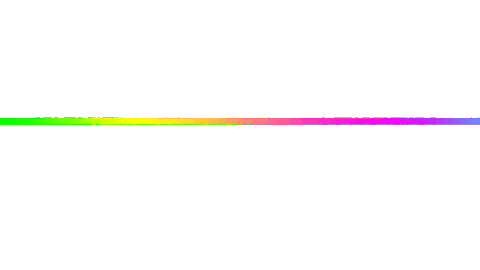

🔗 Click the banner above to visit my [LinkedIn](https://www.linkedin.com/in/ratul-banik1204/)

 

  

  
  ### 🚀 **Ratul Banik** 
  #### *B.Tech Computer Science Engineering | AI & Web Developer*
  
  
  
  

  
---
  
  ### 🌟 **Quick Stats**
  
  
  
  
  

<h1 align="center">Hi there, I'm Ratul Banik 👋🏼</h1>
<h3 align="center">B.Tech CSE | PY & Web Developer from India 🇮🇳</h3>

  I'm a Computer Science Engineering student (2023-2027) with a deep passion for transforming complex problems into elegant, full-stack solutions. I am driven by the process of building and am currently dedicating my time to mastering Data Structures & Algorithms while developing robust applications with the MERN stack.

  
  

  

  
### 🚀 **GitHub Analytics & Performance**

<table width="100%">
  <tr>
    <td width="50%" valign="top">
      
    </td>
    <td width="50%" valign="top">
      
    </td>
  </tr>
</table>

### 🔥 **Coding Streak & Consistency**

  

### 📈 **Detailed Language Statistics**

  

### 🎯 **Repository Insights**

  

### 📊 **Contribution Graph**

  

### 📫 **Get in Touch for Collaboration**

  
  
  

  

  
## 🐍 **GitHub Snake Contribution Animation**

### 🌟 **Main Contribution Snake**

